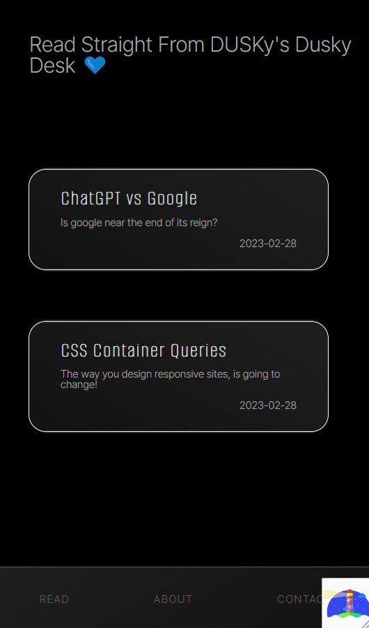
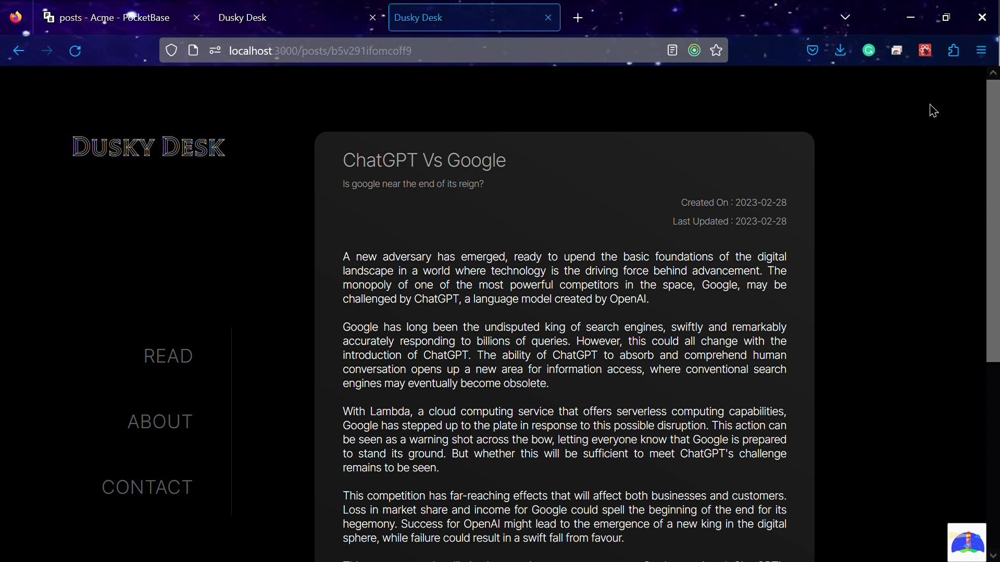

This is a [Next.js](https://nextjs.org/) project bootstrapped with [`create-next-app`](https://github.com/vercel/next.js/tree/canary/packages/create-next-app).

## About Project

This is personal blogging page. Instead of using the popular option of Markdown to edit content, it uses PocketBase to store, create, update, and delete blog data.

## Tech Used

- NextJs 13
- PocketBase
- CSS
- Vercel

*This project is still under developement, and not yet deployed. Below are some screenshots to provide an idea of the project.*

## Project Screenshots

Home Page:
    

Home Page on small screens:
    

Post Page: 
    

Admin Portal To Add New Post (With in-built Rich Editor)

